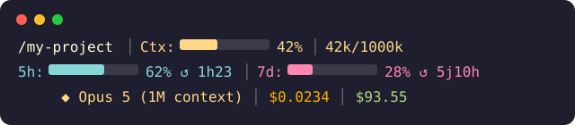
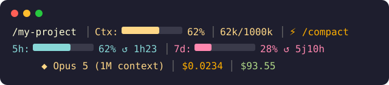

<div align="center">

# claude-quota

**Claude Code Quota Monitor**

Shows your Claude Code token window usage right in your statusline, whatever your subscription (Pro, Max, ...).

[](https://claude.ai/code) [](LICENSE)

</div>

---

## What it does

Claude Code caps usage on two windows, whatever the subscription:

- **5h window** — tokens consumed over the last 5 hours
- **7d window** — tokens consumed over the last 7 days

`claude-quota` shows the model, context usage, rate limits, time until reset, and remaining extra-usage balance in **real time** in your Claude Code statusline — across three lines, in color (one color per segment).

Why three lines instead of one: it takes up less width, so it stays readable when working with several terminal windows side by side. On a single line, information ends up truncated as soon as the window gets narrow — on three lines, everything stays fully visible.

### Statusline example



When context usage goes above 50%:



- **Line 1**: active directory + context bar + token count + `/compact` hint if ≥ 50%
- **Line 2**: rate limit windows + time until reset (`↺ Xh MM`, or `↺ Xj HHh` past 24h)
- **Line 3**: active model + session API cost + remaining extra-usage balance
- **Display**: color per segment (ANSI 256), can be disabled with `NO_COLOR=1`

### `/quota` skill

Type `/quota` or "how much quota do I have left?" for a detailed view with a formatted table.

---

## Installation

### 1. Install the plugin

```bash
claude plugin install claude-quota
```

> If the marketplace isn't added yet:
> ```bash
> claude plugin marketplace add https://github.com/MisterKarott/claude-quota
> claude plugin install claude-quota
> ```

### 2. Configure the statusline

In `~/.claude/settings.json`:

```json
{
  "statusLine": {
    "type": "command",
    "command": "bash ${HOME}/.claude/plugins/cache/github-MisterKarott-claude-quota/claude-quota/1.4.2/scripts/quota-statusline.sh --mode bar",
    "padding": 0
  }
}
```

> Check the exact path with `ls ~/.claude/plugins/cache/ | grep claude-quota` after installing.

### 3. Restart Claude Code

---

## How it works

Claude Code injects data via stdin on every turn. The script reads:

```json
{
  "model": { "display_name": "Opus 5 (1M context)" },
  "context_window": {
    "used_percentage": 42,
    "context_window_size": 1000000,
    "total_input_tokens": 38000,
    "total_output_tokens": 4000,
    "current_usage": { "cache_read_input_tokens": 0, "cache_creation_input_tokens": 0 }
  },
  "rate_limits": {
    "five_hour": { "used_percentage": 62, "resets_at": 1777554600 },
    "seven_day": { "used_percentage": 28, "resets_at": 1777658400 }
  },
  "cost": { "total_cost_usd": 0.0234 }
}
```

The extra-usage balance is fetched via `/api/oauth/organizations/{org}/prepaid/credits` (OAuth token from the macOS keychain), cached for 5 minutes and refreshed in the background. Everything else comes from Claude Code locally.

---

## Components

| Component | Type | Description |
|-----------|------|-------------|
| `quota-statusline.sh` | Script | Statusline display with bars and reset countdowns |
| `quota` | Skill | On-demand detailed view |

---

## Requirements

| Dependency | Why |
|------------|-----|
| Claude Code CLI | Plugin host |
| Claude Code subscription (Pro, Max, ...) | Rate limit data |
| `jq` | JSON parsing |

---

## License

[MIT](LICENSE)

---

<div align="center">

Made with Claude Code

</div>
